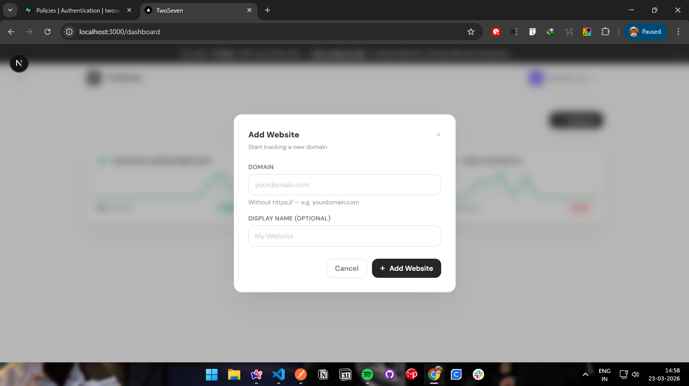
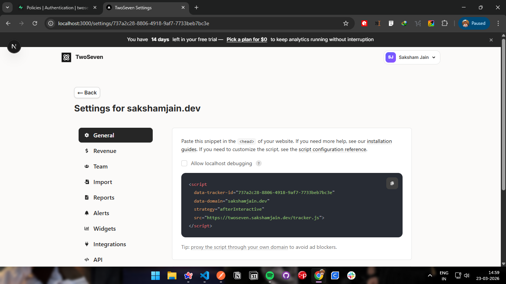
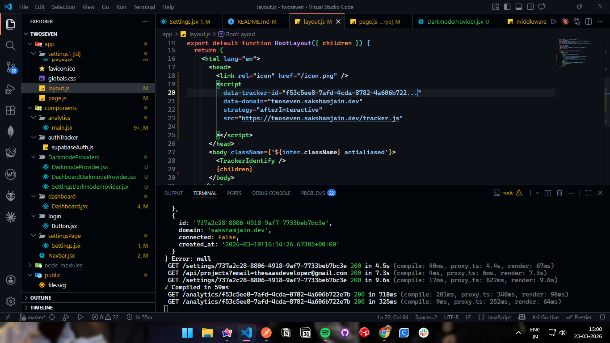

# TwoSeven (The name is based on my birthdate)

Some buttons are not functional such as "Pick a plan" as the website is free for now.

TwoSeven is an open-source analytics platform designed to help users understand and track their website performance with accuracy. The name is inspired by my birthdate.

The platform is currently free to use and aims to provide detailed, reliable insights without the complexity or cost associated with traditional analytics tools.

## How to integrate?
1. Add your website domain in the dashboard

2. Go to the project settings

3. Copy the tracking code and paste it into your <head> tag

## Current Features
 - View the number of visits, new visits, bounce rate, avg. session time during the selected date range
 - Add/remove admin access to specific people who can view the data and modify the settings
 - View individual user data
 - And much more...

## Technical Spefications
 - Next.js 
 - Supabase (auth + db)
 - OpenAnalytics Engine - Built by me (modified for improved and detailed statistics)
 - Geolocation API

## Future improvements
 - Quicker response time
 - Restrictive/Permisive access for admins.
 - Adding viewers that can only view the analytics but not modify the settings
